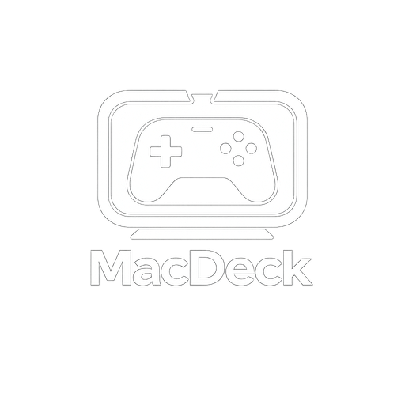

<p align="center">
  
</p>

<h1 align="center">MacDeck</h1>

<p align="center">
  A premium, controller-friendly game launcher for macOS designed to scan, aggregate, and launch games from multiple platforms.
</p>

---

## Overview

MacDeck provides a centralized, console-like interface for managing and playing your game library on macOS. Tailored for couch gaming and controller navigation, it unifies titles installed via Steam, Ryujinx, and Mythic under a single, fluid experience.

## Key Features

- **Platform Integration**: Automated scanning and indexing of games from Steam, Ryujinx, and Mythic.
- **Controller Friendly**: Fully navigable interface designed for gamepads, offering a console-like experience.
- **Metadata Management**: Automatic fetch and caching of game cover art, app identifiers, and details.
- **Premium User Interface**: Modern design matching macOS system aesthetics, featuring smooth animations and transitions.
- **Configurable Settings**: Customizable scanner paths, launcher paths, and application preferences.

## Installation

You can install MacDeck on macOS using Homebrew via the personal tap repository:

```bash
brew tap aman-senpai/apps
brew install --cask macdeck
```

## Setup and Configuration

Upon launch, configure the library paths in the Settings menu:
- **Steam**: Automatically locates standard Steam libraries.
- **Ryujinx**: Specify your ROM directories and Ryujinx application path.
- **Mythic**: Resolves games installed via Epic Games, GOG, and other platforms.

## License

This project is licensed under the MIT License. See the [LICENSE](LICENSE) file for details.
